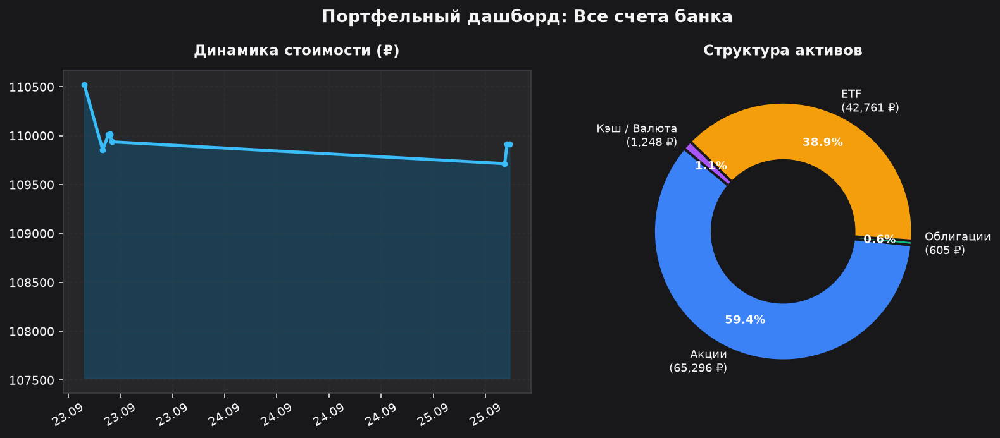
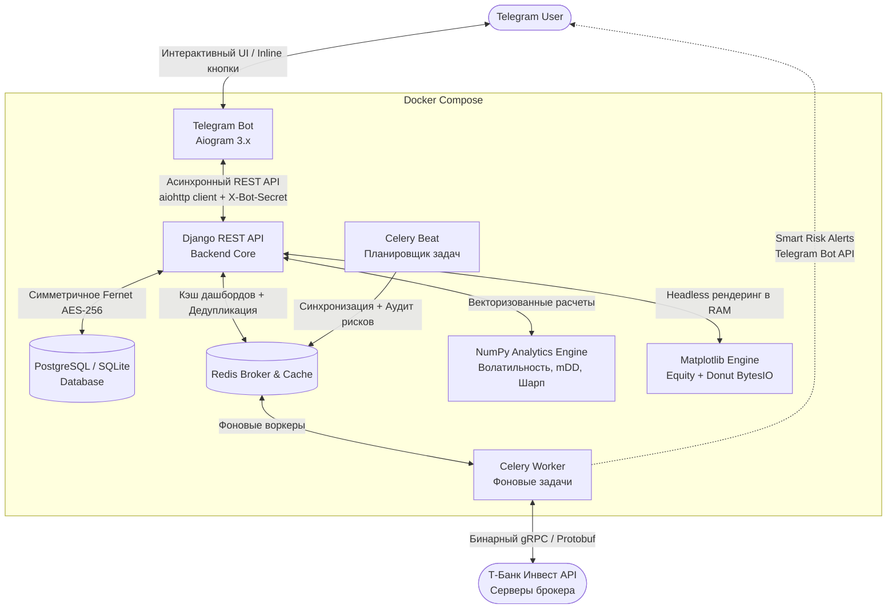

# 📊 T-Invest Portfolio Auditor

> 💬 **Связь с разработчиком**: Telegram [@isrhko](https://t.me/isrhko)

[](https://t.me/isrhko)
[](https://github.com/31MaeStro13/T_INVEST/actions/workflows/ci.yml)
[](https://python.org)
[](https://www.djangoproject.com/)
[](https://docs.celeryq.dev/)
[](https://aiogram.dev/)
[](https://numpy.org/)
[](https://matplotlib.org/)
[](https://cryptography.io/)
[]()
[](https://github.com/agno-agi/agno)
[-brightgreen?logo=pytest&logoColor=white)]()
[](https://www.docker.com/)


Асинхронный финтех-сервис и Telegram-ассистент инвестора для консолидации капитала, математического аудита рисков и умных уведомлений, работающий напрямую с официальным gRPC API **Т-Банк Инвестиций** (`t-tech-investments`).

---

## 📸 Аналитический дашборд (Dark Fintech)

Сервис на лету визуализирует структуру капитала и историческую динамику портфеля, отдавая оптимизированные графики в Telegram-бот:



> **Инженерная особенность**: Matplotlib работает в headless-режиме (`Agg`) строго в оперативной памяти (`io.BytesIO`) без создания временных файлов на диске. Изображения кэшируются по паттерну Cache-Aside в Redis с автоматической инвалидацией при синхронизации портфеля.

---

## 🎯 Какую проблему решает сервис?

У большинства активных частных инвесторов капитал раздроблен между несколькими счетами одного брокера (ИИС, основной брокерский счет, инвесткопилка, стратегии автоследования). 

Это создает **две критические проблемы**:
1. **Иллюзия риска**: бумага может занимать 44% на небольшом спекулятивном счете (вызывая ложную тревогу), но в масштабах всего капитала составлять безопасные 3–5%.
2. **Скрытая концентрация**: один и тот же эмитент (например, акции Сбера или фонд денежного рынка), купленный на разных счетах небольшими долями, суммарно может превышать 35–40% от совокупного капитала инвестора, создавая смертельный для портфеля риск.

**T-Invest Portfolio Auditor** объединяет все счета в единый **Консолидированный портфель (Total Net Worth)**, склеивает пересекающиеся позиции, строит единую кривую доходности и проводит математический аудит рисков на базе портфельной теории.

---

## 🏗 Архитектура системы

Проект спроектирован по модульным микросервисным принципам с полным разделением слоев представления, бизнес-логики и фоновых воркеров:



---

## ⚡️ Ключевые инженерные решения

### 1. Безопасность и Zero-Trust (Шифрование Fernet AES-256)
* Токены Т-Банка с правами Read-Only никогда не сохраняются в базу данных в открытом виде.
* Используется симметричное шифрование **Fernet (AES-128-CBC + HMAC-SHA256)** с аутентифицированным шифрованием.
* Ключ шифрования хранится изолированно в переменных окружения (`ENCRYPTION_KEY`). Даже при полной компрометации дампа БД злоумышленник не получит доступ к токенам.
* Межсервисное взаимодействие между ботом и бэкендом защищено внутренним токеном `X-Bot-Secret` и permission-классом `IsInternalBot`.

### 2. Финансовая точность (Zero-Float Policy)
* Денежные суммы, количество лотов и котировки никогда не приводятся к стандартному типу `float` в базе данных.
* Все вычисления, парсинг gRPC-структур `Quotation` (`units + nano / 1e9`) и хранение балансов осуществляются строго в **`Decimal`**, исключая классические ошибки округления стандарта IEEE 754.

### 3. Автономное аналитическое ядро на NumPy
* Математический модуль [`engine.py`](backend/apps/analytics/engine.py) полностью изолирован от Django ORM и базы данных.
* Принимает стандартные списки Python и рассчитывает:
  * **Годовую волатильность** ($\sigma_{annual} = \text{std}(\text{returns}) \times \sqrt{252}$).
  * **Максимальную историческую просадку (mDD)** через векторный кумулятивный максимум `np.maximum.accumulate`.
  * **Коэффициент Шарпа** относительно безрисковой ставки (текущая ставка ЦБ РФ): $S = \frac{R_p - R_f}{\sigma_p}$.
  * **Концентрационный риск** с детекцией позиций, превышающих лимит 25% капитала.
* Быстродействие: 20 тестов, включая матричные расчеты, выполняются за ~0.3 секунды.

### 4. Консолидация счетов без артефактов (Sawtooth-Fix)
* Агрегирует снимки всех счетов инвестора, объединяет дублирующиеся активы по FIGI/тикеру, вычисляет средневзвешенную цену и выдает единый срез капитала.
* Решена проблема рассинхронизации временных меток при объединении истории нескольких счетов: группировка снимков через `TruncMinute("created_at")` устраняет пилообразные скачки кривой баланса.

### 5. Smart Risk Alerts с защитой от спама (Celery Beat + Redis)
* Фоновый периодический аудит проверяет 3 критических триггера:
  1. Критическая концентрация бумаги (>25% капитала).
  2. Глубокая просадка портфеля (mDD $\le -5\%$).
  3. Неоправданный риск (волатильность >15% при отрицательном коэффициенте Шарпа).
* **TTL-дедупликация**: алерты отправляются не чаще одного раза в 24 часа по ключу `alert_sent:{user_id}:{alert_type}:{item_key}` в Redis.
* **Пользовательский контроль**: инвестор может в 1 клик включить или отключить алерты в настройках бота (`🔔 ВКЛ` / `🔕 ВЫКЛ`).

### 6. Юридическая чистота (Соответствие ст. 6.1 39-ФЗ)
* Сервис осуществляет исключительно **математический и информационный аудит** портфеля.
* Полный запрет на генерацию инвестиционных рекомендаций (покупка/продажа конкретных тикеров).
* Каждый сформированный отчет и график сопровождается дисклеймером Safe Harbor.

### 7. Отказоустойчивый UX в Telegram (Aiogram 3.x)
* **In-Memory передача изображений**: `BufferedInputFile` напрямую из оперативной памяти без I/O-нагрузки на диск.
* **Двухуровневый антиспам (Throttling Middleware)**:
  * Всплывающий нативный тост Telegram при частом нажатии кнопок.
  * Теневой бан (Silent Drop) на 30 секунд при превышении лимита >5 кликов за 3 секунды.
* **Постраничная пагинация**: портфели из 50+ активов отображаются постранично по 5 позиций.

---

## 🧪 Тестирование и CI/CD

Проект покрыт автоматическими тестами (Unit, Security, Integration) и подключен к **GitHub Actions CI**:
* **Unit-тесты** NumPy-ядра: проверка формул Шарпа, волатильности, просадок и граничных условий (нулевая дисперсия, один снимок).
* **Security-тесты**: верификация шифрования/дешифрования Fernet и защиты от утечки сырых токенов.
* **Integration-тесты**: REST API эндпоинты, переключение счетов, аудит триггеров и управление алертами.

Запуск тестов локально:
```bash
uv run python backend/manage.py test users portfolio analytics --noinput --verbosity=2
```
```text
Found 20 test(s).
Creating test database for alias 'default'...
....................
----------------------------------------------------------------------
Ran 20 tests in 0.312s

OK
```

---

## 🚀 Быстрый запуск (Quickstart)

### 1. Клонирование репозитория
```bash
git clone https://github.com/31MaeStro13/T_INVEST.git
cd T_INVEST
```

### 2. Настройка переменных окружения
Создайте файл `.env` на основе шаблона:
```bash
cp .env.example .env
```
Сгенерируйте 32-байтный ключ шифрования Fernet и добавьте его в `.env`:
```bash
python -c "from cryptography.fernet import Fernet; print(Fernet.generate_key().decode())"
```

### 3. Запуск через Docker Compose
Все сервисы (Django Backend, Telegram Bot, Celery Worker, Celery Beat, Redis) запускаются одной командой:
```bash
docker compose up -d --build
```

Проверить статус работы всех контейнеров:
```bash
docker compose ps
```

---

## 🗺 Roadmap развития проекта

- [x] **v1.0.0 — Core Fintech Auditor Engine**: Консолидация счетов, NumPy-аналитика, Fernet-шифрование, Matplotlib-дашборды в RAM, Smart Alerts и CI/CD.
- [x] **v1.1.0 — AI Financial Explainer (Agno Framework)**:
  - Интеграция агентского фреймворка [Agno](https://github.com/agno-agi/agno) с подключением Google Gemini API (`gemini-3.1-flash-lite-preview`).
  - Режим **Tool Calling (Function Calling)**: агент использует функции нашего аналитического ядра (`get_portfolio_risk_metrics`, `get_asset_allocation`) как инструменты для получения точных детерминированных цифр.
  - Строгие Guardrails: системный промпт с Zero-Recommendation Policy для перевода сложных формул на понятный язык инвестора без нарушения ст. 6.1 39-ФЗ.
  - Интерактивный диалоговый режим в Telegram-боте (`AIAuditorState`) без лишнего маркдауна и роботизированных вступлений.
- [ ] **v1.2.0 — Multi-Broker Integration**: Подключение API Альфа-Инвестиций и Финам для кросс-брокерской консолидации.

---

## 🛠 Стек технологий

| Компонент | Технологии |
|---|---|
| **Язык & Менеджер пакетов** | Python 3.12+, `uv` (Astral) |
| **Backend Core** | Django 6.1+, Django REST Framework |
| **AI & LLM Agents** | Agno Framework 3.x, Google Gemini API, Tool Calling |
| **Брокер & Очереди** | Redis 8, Celery 5.6+, Celery Beat |
| **Telegram Bot** | Aiogram 3.x, Aiohttp, FSM, Throttling Middleware |
| **Финансовая математика** | NumPy 2.x, Decimal |
| **Визуализация** | Matplotlib 3.11+ (Headless Agg, BytesIO) |
| **Брокерский API** | `t-tech-investments` (T-Bank Invest gRPC / Protobuf API) |
| **Безопасность** | `cryptography` (Fernet 256-bit AES), Zero-Trust Header |
| **CI / DevOps** | GitHub Actions (`astral-sh/setup-uv`), Docker, Docker Compose |


---

## 📄 Лицензия

Распространяется под лицензией MIT. Подробности в файле [LICENSE](LICENSE).
