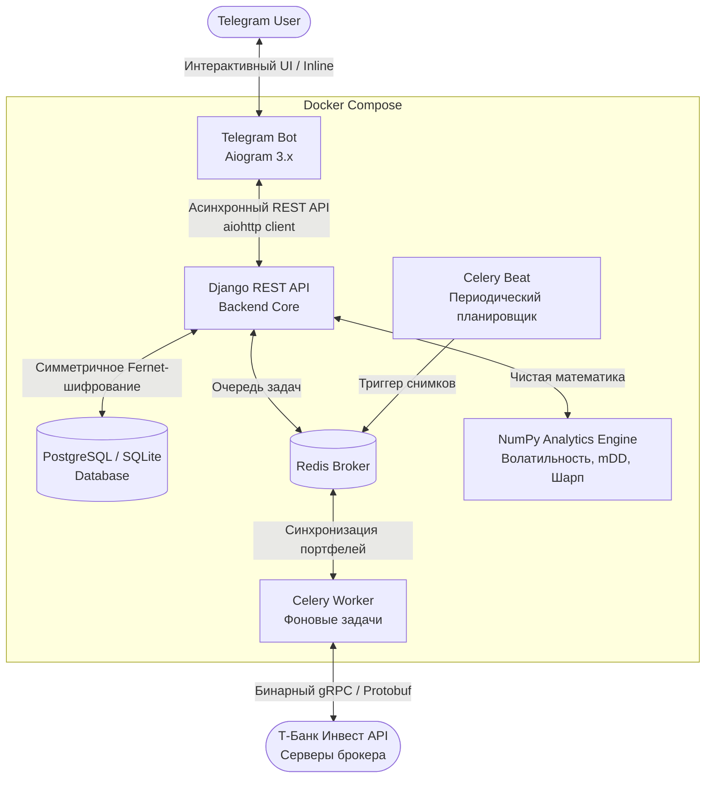

# 📊 T-Invest Portfolio Auditor

[](https://python.org)
[](https://www.djangoproject.com/)
[](https://docs.celeryq.dev/)
[](https://aiogram.dev/)
[](https://numpy.org/)
[](https://www.docker.com/)
[](https://cryptography.io/)
[-brightgreen?logo=pytest&logoColor=white)]()

Асинхронный финтех-сервис и Telegram-ассистент инвестора для аудита рисков, диверсификации и консолидации капитала, работающий напрямую с официальным gRPC API **Т-Банк Инвестиций** (`t-tech-investments`).

---

## 🎯 Какую проблему решает сервис?

У большинства активных инвесторов капитал раздроблен между несколькими счетами одного брокера (ИИС, основной брокерский счет, инвесткопилка, стратегии автоследования). 

Это создает **две критические проблемы**:
1. **Иллюзия риска**: бумага может занимать 44% на небольшом спекулятивном счете (вызывая ложную тревогу), но в масштабах всего капитала составлять безопасные 5%.
2. **Скрытая концентрация**: один и тот же эмитент (например, акции Сбера или фонд ликвидности), купленный на разных счетах небольшими долями, суммарно может превышать 35–40% от совокупного капитала инвестора.

**T-Invest Portfolio Auditor** объединяет все счета в единый **Консолидированный портфель (Total Net Worth)**, склеивает пересекающиеся позиции и проводит математический аудит рисков на базе алгоритмов портфельной теории.

---

## 🏗 Архитектура системы

Проект спроектирован по микросервисным принципам с полным разделением слоев представления, бизнес-логики и фоновых задач:



---

## ⚡️ Ключевые инженерные решения

### 1. Безопасность и Zero-Trust (Шифрование Fernet)
* Токены Т-Банка с правами Read-Only никогда не сохраняются в базу данных в открытом виде.
* Используется симметричное шифрование **Fernet (AES-128 CBC + HMAC SHA256)**.
* Ключ шифрования хранится изолированно в переменных окружения (`ENCRYPTION_KEY`). Даже при полной компрометации дампа БД злоумышленник не получит доступ к токенам.

### 2. Финансовая точность (Zero-Float Policy)
* Денежные суммы и котировки никогда не приводятся к стандартному типу `float` в базе данных.
* Все вычисления, парсинг структур `Quotation` (`units + nano / 1e9`) и хранение балансов осуществляются строго в **`Decimal`**, исключая ошибки округления IEEE 754.

### 3. Автономное аналитическое ядро на NumPy
* Математический модуль [`engine.py`](backend/apps/analytics/engine.py) полностью изолирован от Django ORM и базы данных.
* Принимает стандартные списки Python и рассчитывает:
  * **Годовую волатильность** ($\sigma_{annual} = \text{std}(\text{returns}) \times \sqrt{252}$).
  * **Максимальную историческую просадку (mDD)** через векторный кумулятивный максимум `np.maximum.accumulate`.
  * **Коэффициент Шарпа** относительно безрисковой ставки (ключевой ставки ЦБ РФ, по умолчанию 19%).
  * **Концентрационный риск** с детекцией позиций, превышающих порог 25%.
* Легко тестируется за миллисекунды: юнит-тесты выполняются без инициализации базы данных.

### 4. Консолидация счетов (Map-Reduce над позициями)
* Агрегирует снимки всех счетов инвестора, объединяет дублирующиеся активы по FIGI/тикеру, вычисляет средневзвешенную цену и выдает консолидированный дашборд капитала.
* Позволяет мгновенно переключаться между **«🌐 Все счета банка»** и точечными счетами (например, отдельно ИИС или Брокерский счет).

### 5. Продвинутый UX в Telegram (Aiogram 3.x)
* **Графические прогресс-бары**: визуальное отображение долей активов `[██████░░░░] 60.0%`.
* **Постраничная пагинация позиций**: портфели из 40+ инструментов отображаются компактно страницами по 5 штук без засорения чата.
* **Человекопонятные финансовые вердикты**: вместо сырых коэффициентов бот объясняет метрики языком инвестора (например, *«🟢 Доходность перекрывает ставку ЦБ»* или *«🔴 Риск акций не окупается относительно депозита»*).

---

## 🧪 Тестирование и надежность

Проект покрыт автоматическими тестами:
* **Unit-тесты** NumPy-ядра: проверка формул Шарпа, волатильности, просадок и граничных условий.
* **Security-тесты**: верификация шифрования и дешифрования токенов Fernet.
* **Integration-тесты**: проверка склеивания портфелей и REST API эндпоинтов.

Запуск тестового набора:
```bash
docker compose exec backend python backend/manage.py test users portfolio analytics
```
```text
Found 17 test(s).
Creating test database for alias 'default'...
.................
----------------------------------------------------------------------
Ran 17 tests in 0.050s

OK
```

---

## 🚀 Быстрый запуск (Quickstart)

### 1. Клонирование репозитория
```bash
git clone https://github.com/31MaeStro13/T_INVEST.git
cd T_INVEST
```

### 2. Настройка переменных окружения
Создайте файл `.env` на основе шаблона:
```bash
cp .env.example .env
```
Заполните обязательные переменные:
* `BOT_TOKEN` — токен вашего Telegram-бота (от `@BotFather`).
* `ENCRYPTION_KEY` — сгенерируйте 32-байтный ключ Fernet:
  ```bash
  python -c "from cryptography.fernet import Fernet; print(Fernet.generate_key().decode())"
  ```

### 3. Запуск через Docker Compose
Все сервисы (Backend, Bot, Celery Worker, Celery Beat, Redis) оркеструются одной командой:
```bash
docker compose up -d --build
```

Проверить статус контейнеров:
```bash
docker compose ps
```

---

## 🛠 Стек технологий

| Компонент | Технологии |
|---|---|
| **Язык & Менеджер пакетов** | Python 3.12+, `uv` (Astral) |
| **Backend & API** | Django 5.x, Django REST Framework |
| **Брокер & Очереди** | Redis 7, Celery 5.x, Celery Beat |
| **Telegram Bot** | Aiogram 3.x, Aiohttp, FSM |
| **Финансовая аналитика** | NumPy 2.x, Decimal |
| **Внешняя интеграция** | `t-tech-investments` (T-Bank Invest gRPC / Protobuf API) |
| **Безопасность** | `cryptography` (Fernet Symmetric Encryption) |
| **Инфраструктура** | Docker, Docker Compose |

---

## 📄 Лицензия

Распространяется под лицензией MIT. Подробности в файле [LICENSE](LICENSE).
